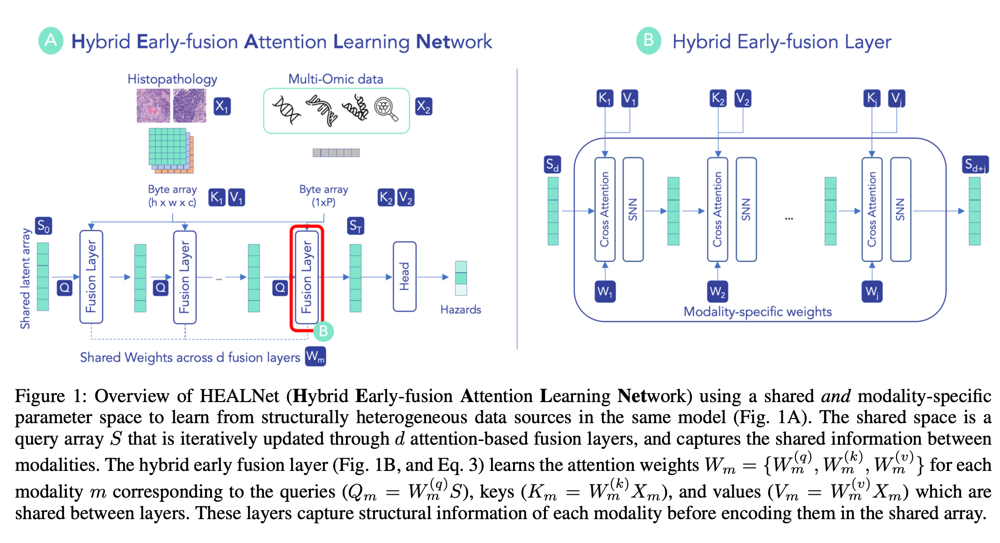

# HEALNet

Code repository for paper: HEALNet - Hybrid Multi-Modal Fusion for Heterogeneous Biomedical Data. 

[Paper Link](https://arxiv.org/abs/2311.09115)




## Quickstart 

### Local install

First, locally install HEALNet using pip.
```
git clone <https/ssh_path>
cd healnet
pip install -e .
```

### Usage

```python
from healnet.models import HealNet
from healnet.etl import MMDataset
import torch
import einops

n = 1000 # number of samples
b = 4 # batch size
img_c = 3 # image channels
tab_c = 1 # tabular channels
tab_d = 5000 # tabular features
h = 512 # image height
w = 512 # image width

# synthetic data example
tab_tensor = torch.rand(size=(n, tab_c, tab_d)) # assume 5k tabular features
img_tensor = torch.rand(size=(n, img_c, h, w)) # c h w
dataset = MMDataset([tab_tensor, img_tensor])

[tab_sample, img_sample] = dataset[0]

# batch dim for illustration purposes
tab_sample = einops.repeat(tab_sample, 'c d -> b c d', b=1)
img_sample = einops.repeat(img_sample, 'c h w -> b c (h w)', b=1)

model = HealNet(
            modalities=2, 
            input_channels=[tab_c, img_c], 
            input_axes=[1, 1], # channel axes (0-indexed)
            num_classes = 4
        )

# example forward pass
model([tab_sample, img_sample])
```

Please view `notebooks/sample.ipynb` for a more detailed example.

## Reproducing experiments

If you want to reproduce the results in the paper instead of using HEALNet as a standalone module, you need to install a few more dependencies. 

### Conda/Mamba environment

Install or update the conda/mamba environment using and then activate. For a faster installation, we recommend using `mamba`. 

```
conda env update -f environment.yml
conda activate cognition
```


### CLI for additional dependenceis 

On Mac or Linux, you can install the below dependencies using the command line

```bash
invoke install --system <system>
```
for both `linux` and `mac`. 

This will auto-install the requirements below (OpenSlide and GDC client). Please follow detailed instructions below if our pre-written installation fails.  

#### Openslide
Note that for `openslide-python` to work, you need to install `openslide` separately on your system. 
See [here](https://openslide.org/download/) for instructions. 

#### GDC client
To download the WSI data, you need to install the [gdc-client](https://docs.gdc.cancer.gov/Data_Transfer_Tool/Users_Guide/Data_Download_and_Upload/) for your respective platform


### Data


#### Download
From the root of the repository, run

1. Specify the path to the gdc-client executable in `main.yml` (this will likely be the repository root if you installed the dependencies using `invoke install`). 
2. Run `invoke download --dataset <dataset> --config_path <config>`, e.g., invoke download --dataset brca

If you are unsure about which arguments are available, you can always run `invoke download --help`.

The script downloads the data using the given manifest files in `data/tcga/gdc_manifests/full` and save it in the data folder under `tcga/wsi/<dataset>` taking the following structure: 

```
tcga/wsi/<dataset>/
	├── slide_1.svs
	├── slide_2.svs
	└── ...
```

If a data manifest file is not available for a given cancer site, you can select the files and download the manifest using the [NIH Genomic Data Commons Data Portal](https://portal.gdc.cancer.gov/). You can filter the .svs tissue and diagnostics slide files   

### Preprocessing

To ensure comparability with baselines, want to have the option to run the model in the WSI patches and extracted features using the [CLAM](https://github.com/mahmoodlab/CLAM) package. 

To extract he patches, run

```bash 
invoke preprocess --dataset <dataset> --config <config> --level <level>
```
Which will extract to the following structure

```
tcga/wsi/<dataset>_preprocessed/
	├── masks
    		├── slide_1.png
    		├── slide_2.png
    		└── ...
	├── patches
    		├── slide_1.h5
    		├── slide_2.h5
    		└── ...
	├── stitches
    		├── slide_1.png
    		├── slide_2.png
    		└── ...
	└── process_list_autogen.csv
```

Note that the slide.h5 files contain the coordinates of the patches that are to be read in 
via OpenSlide (x, y coordinates). 

On first run of the pipeline, the script will add an additional folder called `patch_features` which contains the ImageNet50 extracted features after patch normalisation as a 1024-dimensional tensor (using PyTorch serialisation). 

```
	├── patch_features
    		├── slide_1.pt
    		├── slide_2.pt
    		└── ...
```


### Datasets

This repo contains the manifests and scripts to easily download the following 8 cancer sites from The Cancer Genome Atlas. You can use the GDC Data Access Tool and use the same scripts if you require additional data.  
 

#### TCGA

- [BLCA](https://wiki.cancerimagingarchive.net/pages/viewpage.action?pageId=16056367): Urothelial Bladder Carcinoma 
- [BRCA](https://wiki.cancerimagingarchive.net/pages/viewpage.action?pageId=3539225): Breast Invasive Carcinoma 
- [UCEC](https://wiki.cancerimagingarchive.net/pages/viewpage.action?pageId=19039602): Uterine Corpus Endometrial Carcinoma
- [KIRP](https://wiki.cancerimagingarchive.net/pages/viewpage.action?pageId=11829555): cevical Kidney Renal Papillary Cell Carcinoma
- [LUAD](https://wiki.cancerimagingarchive.net/pages/viewpage.action?pageId=6881474): Lung Adenocarcinoma 
- [LUSC](https://wiki.cancerimagingarchive.net/pages/viewpage.action?pageId=16056484): Lung Squamous Cell Carcinoma
- [PAAD](https://gdc.cancer.gov/resources-tcga-users/tcga-code-tables/tcga-study-abbreviations): Pancreatic adenocarcinoma
- [HNSC](https://wiki.cancerimagingarchive.net/pages/viewpage.action?pageId=11829589): Head and Neck Squamous Cell Carcinoma 

#### Biobank

To be added

## Running Experiments

### Single run

Given the configuration in `config.yml`, you can launch a single run using. Note that all below commands assume that you are in the repository root. 

```bash
python3 healnet/main.py 
```

You can view the available command line arguments using 

```bash
python3 healnet/main.py --help
```

### Full run

```bash
python3 healnet/main.py --mode run_plan
```

### Hyperparameter search

You can launch a hyperparameter search by passing the `--hyperparameter_sweep` argument. 

```bash
python3 healnet/main.py --hyperparameter_sweep
```

Note that the sweep parameters are specified in the `config/sweep.yaml` file. If a parameter is not specified as part of the parameter sweep, the program will default to whatever is configured in `config/main_gpu.yml`
