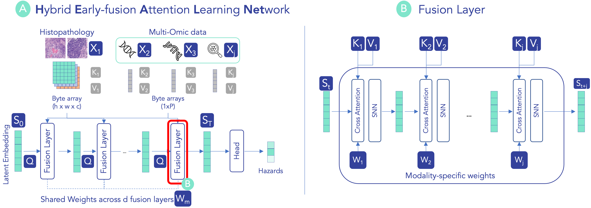

# HEALNet

Code repository for paper [**_HEALNet: Multimodal Fusion for Heterogeneous Biomedical Data_**](https://arxiv.org/abs/2311.09115)

## An architecture for flexible and robust multimodal pipelines

[[pdf](https://arxiv.org/pdf/2311.09115) | [Installation](#Quickstart) | [Experimental Data](#data) | [Getting Started](./tutorial/01_Getting_Started.ipynb) | [Cite](#citation)]




## Why use this model? 

* **Preserve modality-specific signal**: HEALNet learns modality-specific weights for each modality and projects it into a shared embedding. Positional encodings capture spatial signal for the specified number of spatial dimensions. 
* **Learn cross-modal interactions**: By passing a latent embedding through the fusion layers (Figure B), we 1) iteratively encode each modality into the share embedding which 2) consequently becomes the context for the next modality. As such, this latent becomes a "learned query" that is updated in each layer pass.
* **Handling missing modalities**: The model's iterative architecture allows skipping missing modalities for individual samples at train or inference time without adding much noise. This allows to train on **all** data without being restricted to the intersection of available modalities. 
* **Model inspection**: The model can be inspected through the modality-specific attention weights. 

## Updates

* **8/12/2024**: Camera-ready release (v0.1.0) available! 
* **25/09/2024**: HEALNet has been accepted to NeurIPS 2024. [Reach out](mailto:konstantin.hemker@cl.cam.ac.uk) to chat in Vancouver! 


## Quickstart 

### Installation

First, locally install HEALNet using pip.

```bash 
git clone git@github.com:konst-int-i/healnet.git
cd healnet
conda create --name healnet python=3.9
```

We provide two sets of dependencies for installation:
* Lightweight: access to `healnet.models` 
* All: access to entire experimental pipeline

#### Lightweight dependencies

We recommend the lightweight installation if you only want to use the `healnet.models` to build on top of HEALNet in a different pipeline.

```bash
pip install -e .
```

#### Full dependencies

The full experiments require some further dependencies which can be installed using

```bash
pip install -e .[all]
```

Note that you require the `.[all]` installation to run the tutorial. 


You can test the installation by running the `pytests`

```bash
pytest -v healnet/tests/
```


### Usage

```python
from healnet import HealNet
from healnet.etl import MMDataset
import torch
import einops

# synthetic data example
n = 100 # number of samples
b = 4 # batch size
img_c = 3 # image channels
tab_c = 1 # tabular channels
tab_d = 2000 # tabular features
# 2D dims
h = 224 # image height
w = 224 # image width
# 3d dim
d = 12

tab_tensor = torch.rand(size=(n, tab_c, tab_d)) 
img_tensor_2d = torch.rand(size=(n, h, w, img_c)) # h w c
img_tensor_3d = torch.rand(size=(n, d, h, w, img_c)) # d h w c
dataset = MMDataset([tab_tensor, img_tensor_2d, img_tensor_3d])

[tab_sample, img_sample_2d, img_sample_3d] = dataset[0]

# batch dim for illustration purposes
tab_sample = einops.repeat(tab_sample, 'c d -> b c d', b=1) # spatial axis: None (pass as 1)
img_sample_2d = einops.repeat(img_sample_2d, 'h w c -> b h w c', b=1) # spatial axes: h w
img_sample_3d = einops.repeat(img_sample_3d, 'd h w c -> b d h w c', b=1) # spatial axes: d h w

tensors = [tab_sample, img_sample_2d, img_sample_3d]


model = HealNet(
            n_modalities=3, 
            channel_dims=[2000, 3, 3], # (2000, 3, 3) number of channels/tokens per modality
            num_spatial_axes=[1, 2, 3], # (1, 2, 3) number of spatial axes (will be positionally encoded to preserve spatial information)
            out_dims = 4
        )

# example forward pass
logits = model(tensors)
```

Please view our [Getting Started Notebook](./tutorial/01_Getting_Started.ipynb) for a more detailed example.


## Reproducing experiments

If you want to reproduce the results in the paper instead of using HEALNet as a standalone module, you need to install a few more dependencies. 

### Conda/Mamba environment

Install or update the conda/mamba environment using and then activate. For a faster installation, we recommend using `mamba`. 

```
conda env update -f environment.yml
```


### CLI for additional dependenceis 

On Mac or Linux, you can install the below dependencies using the command line

```bash
invoke install --system <system>
```
for both `linux` and `mac`. 

This will auto-install the requirements below (OpenSlide and GDC client). Please follow detailed instructions below if our pre-written installation fails.  

#### Openslide
Note that for `openslide-python` to work, you need to install `openslide` separately on your system. 
See [here](https://openslide.org/download/) for instructions. 

#### GDC client
To download the WSI data, you need to install the [gdc-client](https://docs.gdc.cancer.gov/Data_Transfer_Tool/Users_Guide/Data_Download_and_Upload/) for your respective platform


### Data

#### Multiomic download

We are using git-lfs to store the pre-processed mutation, CNV, and gene expression data. 

```bash
sudo apt-get install git-lfs
git lfs install
git lfs pull
```

This will pull the data into `data/tcga/omic` and `data/tcga/omic_xena`. 


#### WSI Download
From the root of the repository, run

1. Specify the path to the gdc-client executable in `main.yml` (this will likely be the repository root if you installed the dependencies using `invoke install`). 
2. Run `invoke download --dataset <dataset> --config_path <config>`, e.g., invoke download --dataset brca

If you are unsure about which arguments are available, you can always run `invoke download --help`.

The script downloads the data using the given manifest files in `data/tcga/gdc_manifests/full` and save it in the data folder under `tcga/wsi/<dataset>` taking the following structure: 

```
tcga/wsi/<dataset>/
	├── slide_1.svs
	├── slide_2.svs
	└── ...
```

If a data manifest file is not available for a given cancer site, you can select the files and download the manifest using the [NIH Genomic Data Commons Data Portal](https://portal.gdc.cancer.gov/). You can filter the .svs tissue and diagnostics slide files   

### Preprocessing

To ensure comparability with baselines, want to have the option to run the model in the WSI patches and extracted features using the [CLAM](https://github.com/mahmoodlab/CLAM) package. 

To extract he patches, run

```bash 
invoke preprocess --dataset <dataset> --config <config> --level <level>
```
Which will extract to the following structure

```
tcga/wsi/<dataset>_preprocessed/
	├── masks
    		├── slide_1.png
    		├── slide_2.png
    		└── ...
	├── patches
    		├── slide_1.h5
    		├── slide_2.h5
    		└── ...
	├── stitches
    		├── slide_1.png
    		├── slide_2.png
    		└── ...
	└── process_list_autogen.csv
```

Note that the slide.h5 files contain the coordinates of the patches that are to be read in 
via OpenSlide (x, y coordinates). 

On first run of the pipeline, the script will add an additional folder called `patch_features` which contains the ResNet50 extracted features after patch normalisation as a 2048-dimensional tensor (using PyTorch serialisation). 

```
	├── patch_features
    		├── slide_1.pt
    		├── slide_2.pt
    		└── ...
```


### Datasets

This repo contains the manifests and scripts to easily download the following 8 cancer sites from The Cancer Genome Atlas. You can use the GDC Data Access Tool and use the same scripts if you require additional data.  
 

#### TCGA

- [BLCA](https://wiki.cancerimagingarchive.net/pages/viewpage.action?pageId=16056367): Urothelial Bladder Carcinoma 
- [BRCA](https://wiki.cancerimagingarchive.net/pages/viewpage.action?pageId=3539225): Breast Invasive Carcinoma 
- [UCEC](https://wiki.cancerimagingarchive.net/pages/viewpage.action?pageId=19039602): Uterine Corpus Endometrial Carcinoma
- [KIRP](https://wiki.cancerimagingarchive.net/pages/viewpage.action?pageId=11829555): cevical Kidney Renal Papillary Cell Carcinoma
- [LUAD](https://wiki.cancerimagingarchive.net/pages/viewpage.action?pageId=6881474): Lung Adenocarcinoma 
- [LUSC](https://wiki.cancerimagingarchive.net/pages/viewpage.action?pageId=16056484): Lung Squamous Cell Carcinoma
- [PAAD](https://gdc.cancer.gov/resources-tcga-users/tcga-code-tables/tcga-study-abbreviations): Pancreatic adenocarcinoma
- [HNSC](https://wiki.cancerimagingarchive.net/pages/viewpage.action?pageId=11829589): Head and Neck Squamous Cell Carcinoma 

#### Biobank

To be added

## Running Experiments

### Single run

Given the configuration in `config.yml`, you can launch a single run using. Note that all below commands assume that you are in the repository root. 

```bash
python3 healnet/main.py
```

To prevent import errors, you may have to add your local path to the `PYTHONPATH`

```bash
export PYTHONPATH=<path_to_repository>:$PYTHONPATH
```

You can view the available command line arguments using 

```bash
python3 healnet/main.py --help
```

### Full run

```bash
python3 healnet/main.py --mode run_plan
```

### Hyperparameter search

You can launch a hyperparameter search by passing the `--hyperparameter_sweep` argument. 

```bash
python3 healnet/main.py --hyperparameter_sweep
```

Note that the sweep parameters are specified in the `config/sweep.yaml` file. If a parameter is not specified as part of the parameter sweep, the program will default to whatever is configured in `config/main_gpu.yml`


